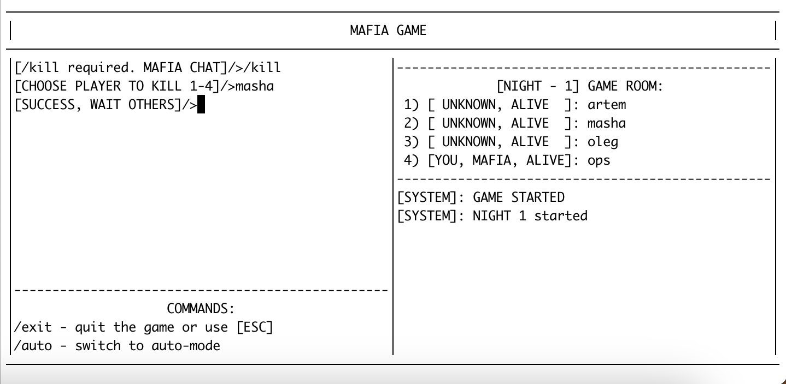
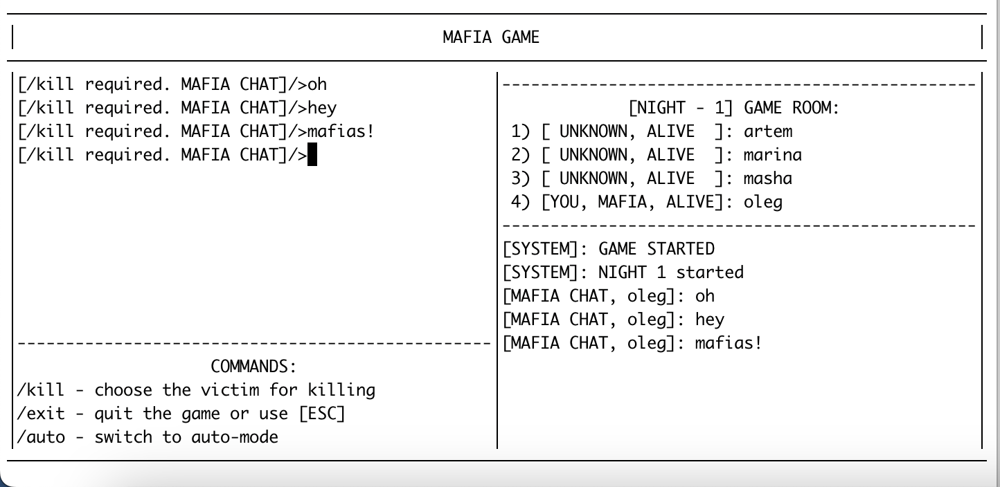
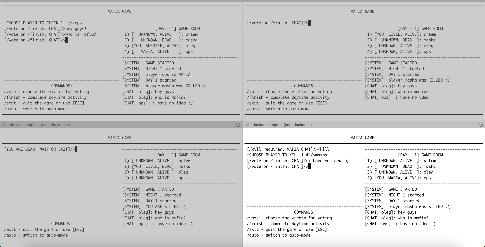

# Проект SOA-mafia

Инструкции к запуску:
1. Собрать контейнеры: `docker-compose build`
2. Запустить grpc-сервер и очередь сообщений rabbit-mq: `docker-compose up -d`
3. Подождать некоторое время, пока поднимется `rabbit-mq` (занимает около 10-15 секунд)
4. Запустить клиентов: `docker-compose run --rm client ./app` (если `rabbit-mq` еще не отвечает, клиенты не запустятся)

Клиентов может быть сколько угодно. При наборе очереди из 4 клиентов собирается игровая сессия автоматически.

Ожидаемый консольный интерфейс после ввода имени: 

C помощью команды `/auto` можно перевести клиента в авто-режим до конца игры. Лог выбора отображается.

## Шаги игры: 

1. Для подключения к серверу нужно ввести уникальное имя пользователя. Если такой пользователь уже существует, клиент предложит ввести другое имя.
2. Дальнейшие инструкции появляются в левой части экрана перед курсором. Так, например, выглядит необходимость выбрать жетву мафии: 

    Для выбора игрока можно напечатать либо его номер, либо имя, отображаемое в правой части экрана. Но для начала нужно ввести команду `/kill`, иначе весь ввод отправляется в ночной чат.

3. Состояние игры, известное игроку отображается вверху правой панели. Все события, происходящие в игре приходят как сообщения от [SYSTEM]. Отображаются справа. 

4. Список доступных команд отображается внизу слева. Чтобы использовать команду, ее нужно ввести и нажать `Enter`. По аналогии с использованием команд для телеграмм ботов.

5. В дневное время можно либо проголосовать, нажав команду `/vote` и затем выбрать цель, либо завершить день без голосования, нажав команду `/finish`

Пример полного лога игры после ее завершения: 

Как можно видеть, появляется команда `/replay`, позволяющая снова зайти в waiting-room и начать новую игру.

## Чат игры: 

После присоединения к игровой сессии каждый клиент подсоединяется к `rabbit-mq` по ключу-идентификатору игровой сессии, полученным от сервера. 

Мафия может общаться ночью в изолированном чате: 

В данном примере мафия только одна, но ее сообщения не видят другие пользователи, и они не могут отправлять ночью сообщения в чат.

В дневное время все могут общаться. Сообщения рассылаются с помощью встроенного `broadcast` по `routing-key` в `rabbit-mq`. Вот так выглядит дневной чат для игровой сессии. Отображается отправитель сообщения и его текст: 

