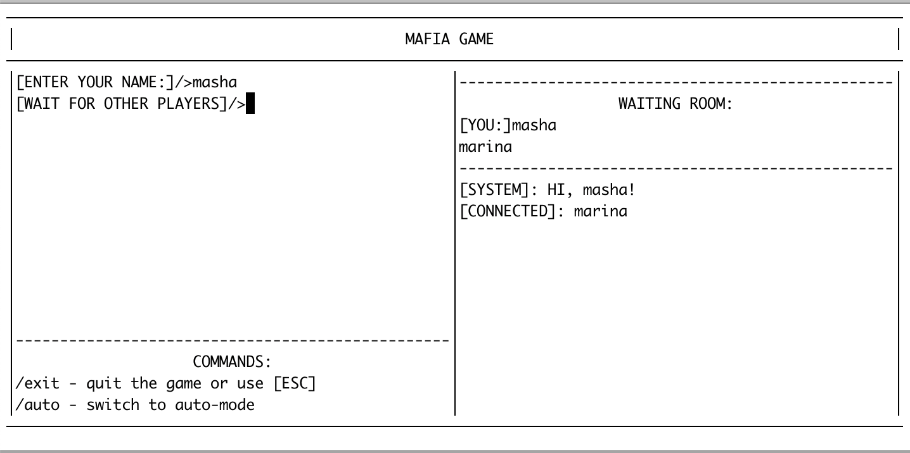
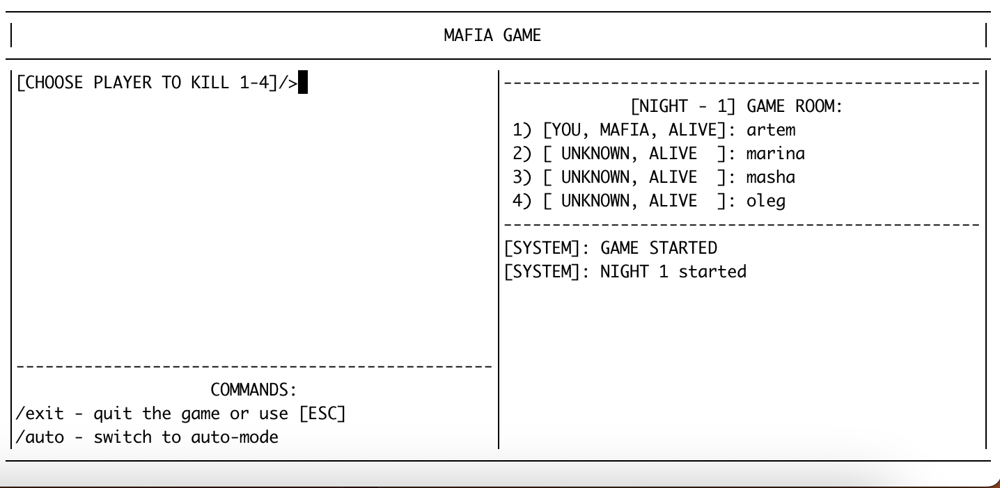
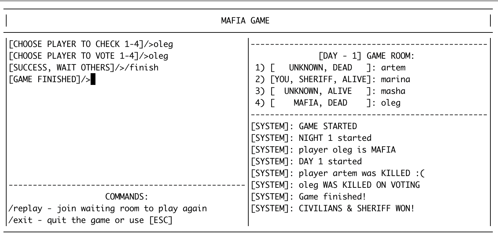

# Проект SOA-mafia

Инструкции к запуску:
1. Собрать контейнеры: `docker-compose build`
2. Запустить grpc-сервер: `docker-compose up -d`
3. Запустить клиентов: `docker-compose run --rm client ./app`

Клиентов может быть сколько угодно. При наборе очереди из 4 клиентов собирается игровая сессия автоматически.

Ожидаемый консольный интерфейс после ввода имени: 

C помощью команды `/auto` можно перевести клиента в авто-режим до конца игры. Лог выбора отображается.

## Шаги игры: 

1. Для подключения к серверу нужно ввести уникальное имя пользователя. Если такой пользователь уже существует, клиент предложит ввести другое имя.
2. Дальнейшие инструкции появляются в левой части экрана перед курсором. Так, наприме, выглядит необходимость выбрать жетву мафии: 

Для выбора игрока можно напечатать либо его номер, либо имя, отображаемое в правой части экрана.

3. Состояние игры, известное игроку отображается вверху правой панели. Все события, происходящие в игре приходят как сообщения от [SYSTEM]. Отображаются справа. 

4. Список доступных команд отображается внизу слева. Чтобы использовать команду, ее нужно ввести и нажать `Enter`. По аналогии с использованием команд для телеграмм ботов.

Пример полного лога игры после ее завершения: 

Как можно видеть, появляется команда `/replay`, позволяющая снова зайти в waiting-room и начать новую игру.

